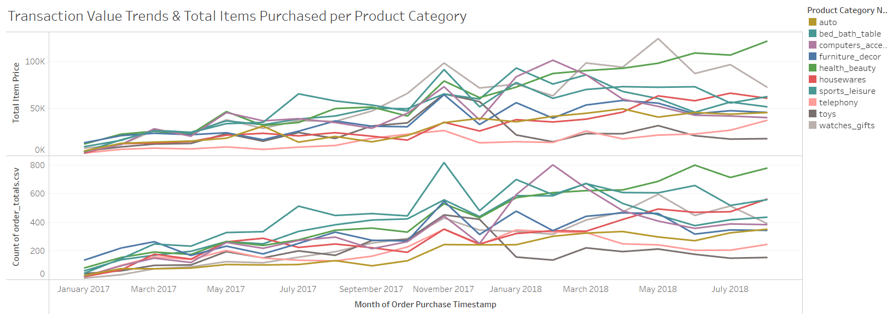
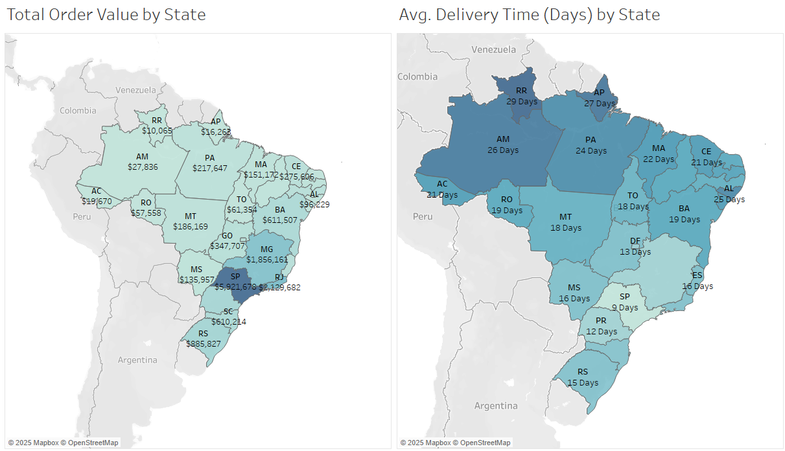
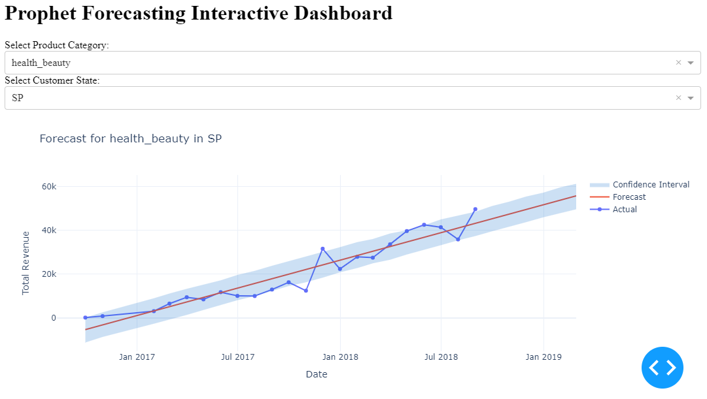
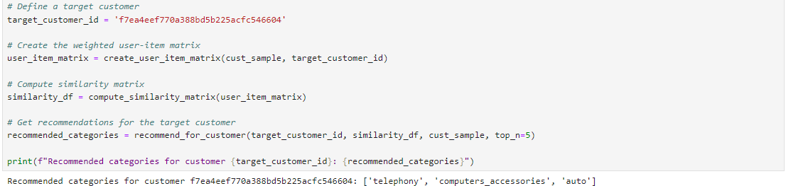

## Capstone Project Introduction
An E-commerce company is looking to attract new customers to shop on their online marketplace. After some internal investigation and research, the upper management of the company concluded that they would need a new personalised shopping experience for each customer, and also a more personalised or localised marketing when it comes to the products themselves. 

## Project Objective 
The main objective of this project is to successfully solve the company’s problems with a machine learning model that can aid in the personalisation and localisation of a customer’s shopping experience and product’s marketing plan. 

## Data Source 
Kaggle - https://www.kaggle.com/datasets/olistbr/brazilian-ecommerce

## Data Processing 
Raw data were cleaned with Python on Jupyter Notebook
- Null values and duplicates were removed selectively 
- Products category names were all in Portuguese, thus language was translated to English through merging of Products and Translation table
- Products, Items, and Orders tables were merged as well to provide further analysis, and for preparation of machine learning model usage

## Data Insights 

This graph shows the trend of total transaction value and total orders of the top 10 products from 2017 Jan - 2018 Aug. The trend is **moving upwards** as the months past, and **sharp spikes in transaction value and orders** can be seen as well, especially during **November 2017** and **February 2018**. This seems to be aligned with the festive season of **Black Friday, Christmas, and Valentines’ day**, suggesting that their customers shopped the most during these seasons, and the team has to be ready for it. 

 
 

This map below shows the total order value (Left), and average delivery time (Right), separated into each individual state. States like **São Paulo (SP)** and **Rio de Janeiro (RJ)** observed the highest spends at **$5.9M and $2.1M** respectively, while states like **Roraima (RR)** and **Amapa (AP)** had the least spends at **$10K and $16K** respectively. Delivery time on the other hand, observes the opposite effect. This suggest that each state has its **own personality, spending power and shopping habits**.

## Proposed Solution 

### Prophet

A time series forecasting model was built to be able to predict the sales of a selected product, for a particular state, 6 months in advance. Prophet was used as the time series model as it deals with missing data better than other time series models.

This model was built by grouping the dataset by the months, followed by each product category and state that each customer lives in. The price paid by each customer was also aggregated to find the total spends on each product, and thus the total revenue for the brand. Customer state was used as an external factor that can influence the forecast as the spendings of each state is different.

Please view full steps and code in the [Jupyter Source File.](https://github.com/MatthiasJY/GA_Capstone/blob/main/Capstone%20Prophet%20Forecasting%20Code.ipynb)

**Success Rate of Model** 
In terms of the success of the model, it achieved its set criteria to get a low RMSE. As compared to the mean value, RMSE is 77.10% lower than the mean. This suggests that the predictions are close to the actual values. R2 on the other hand, is negative which means that the predicted values are also random. However, as the dataset only has 22 months of data and different missing values for each product category, the model is greatly limited by these factors.

### Collaborative Filtering Recommendation System

A Recommendation System was created as well with the Collaborative Filtering method to recommend up to 5 product categories for each unique customer by comparing with other customers that are closest in terms of similarity.

The similarity score is measured based on the customers reviews and state that they live in. Higher ratings for the reviews like 4 or 5, were emphasised more than lower ratings like 1 or 2. Customers within the same state also produced a higher similarity score than customers from different states. This is so that the model can suggest accurately. 

Please view full steps and code in the [Jupyter Source File.](https://github.com/MatthiasJY/GA_Capstone/blob/main/Capstone%20Recommendation%20System%20Code.ipynb)

**Success Rate of Model** 
In terms of the success of this model, it is a great success as the Precision and Recall score are both within the success criteria. The 0.60 Precision suggests that the model is relatively good at recommending items that are relevant, but 40% of the recommended items are irrelevant. On the other hand, the 0.95 Recall suggests that the model is very good at recommending most of the items that are relevant to the user. It misses only about 5% of the relevant items, which means it's quite comprehensive in its recommendations. 

## Limitations 

The limitations of this model would be the small size of the dataset, and inevitable missing data for Prophet. As it is a forecasting model based on time series, it would only perform well with an adequate number of “time”. As this data only recorded about 1.5 years, it was not enough to produce an accurate result.

Limitations for the Collaborative Filtering model would be the high intensity in computing processing needed to run a bigger model. This is because it is highly intensive to run a matrix of 100,000 by 100,000 for example, even though it would be more accurate. 

## Recommendations 
In conclusion, we recommend this e-commerce brand to make use of the Prophet model and Collaborative Filtering model to achieve their goal of localising marketing strategies and personalising customer experiences. 

The Prophet model helps them know how each product category is predicted to perform in terms of total revenue 6 months into the future, and how it differs from each individual state as well. 

The Collaborative Filtering model integrated into the e-commerce website will allow for a more personalised customer experience. This new shopping experience only benefit existing customers as it's a new and novel feature, but also attract new customers as it is an experience that they are searching for. 

